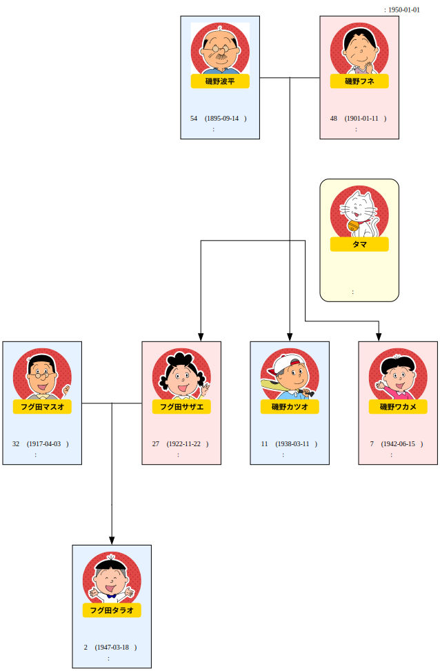

# 家系図ビジュアライザー

Graphviz を使って家系図を自動生成する CLI ツールです。YAML ファイルに家族の情報を記述するだけで家系図が作成できます。

## セットアップ

### 前提条件

- **[uv](https://github.com/astral-sh/uv)** がインストールされていること
- **[Graphviz](https://graphviz.org/)** がインストールされていること

#### uv のインストール

```bash
curl -LsSf https://astral.sh/uv/install.sh | sh
```

#### Graphviz のインストール（macOS）

```bash
brew install graphviz
```

### 依存ライブラリのインストール

リポジトリをクローンしたら、以下を実行します。

```bash
uv sync
```

これで `pyyaml` と `graphviz`（Python バインディング）が自動的にインストールされます。

---

## 使い方

```bash
uv run python main.py [YAMLファイル] [オプション]
```

### 引数・オプション

| 引数 / オプション | 説明 | デフォルト |
|---|---|---|
| `input` | 入力 YAML ファイルのパス | `sample.yaml` |
| `--output`, `-o` | 出力ファイル名（拡張子なし） | `sample` |
| `--as-of YYYY-MM-DD` | 年齢計算の基準日 | スクリプト実行日 |
| `--hide-job` | 職業情報を非表示 | 表示 |

### 実行例

```bash
# sample.yaml を使って sample.svg を生成
uv run python main.py

# 任意の YAML を指定
uv run python main.py my_family.yaml

# 出力ファイル名を指定
uv run python main.py --output my_family

# 1990年1月1日時点の年齢で家系図を生成
uv run python main.py --as-of 1990-01-01

# 職業情報を非表示にして生成
uv run python main.py --hide-job
```

---

## YAML の書き方

`sample.yaml` を参考に、家族の情報を記述してください。

```yaml
people:
  - name: "磯野 波平"          # 氏名（必須）
    reading: "いその なみへい"  # ふりがな
    sex: male                   # 性別: male / female
    birthday: "1895-09-14"      # 生年月日 (YYYY-MM-DD)
    deathday: null              # 命日 (null = 存命)
    job: "会社員"               # 職業
    image_path: "photos/namihei.png"  # 写真のパス (省略可)
    parents: []                 # 親の氏名リスト（両親を指定）

  - name: "磯野 フネ"
    reading: "いその ふね"
    sex: female
    birthday: "1901-01-11"
    deathday: null
    job: "主婦"
    image_path: ""
    parents: []

  - name: "フグ田 サザエ"
    reading: "ふぐた さざえ"
    sex: female
    birthday: "1922-11-22"
    deathday: null
    job: "主婦"
    image_path: ""
    parents: ["磯野 波平", "磯野 フネ"]  # 両親の名前を指定
```

### 写真の配置

写真は `image_path` に相対パスで指定します。パスは **スクリプト実行ディレクトリ（プロジェクトルート）を基準**にします。

```
family-tree-vis/
├── main.py
├── sample.yaml
└── photos/
    ├── namihei.png
    └── sazae.png
```

対応フォーマット: PNG / JPEG など Graphviz がサポートする画像形式

### ペットの記述

`type: pet` と `owner` を指定すると、ペットとして扱われます。

```yaml
  - name: "タマ"
    reading: "たま"
    sex: male
    birthday: ""
    job: "飼い猫"
    image_path: ""
    parents: []
    type: "pet"
    owner: "磯野 波平"  # 飼い主の名前
```

---

## 出力

実行後、指定した名前の SVG ファイルが生成されます（デフォルト: `sample.svg`）。
写真がある場合は Base64 で SVG に埋め込まれるため、ファイル単体でブラウザや他のツールで開くことができます。



なお、各写真は、[こちら](https://www.sazaesan.jp/characters.html)のページから借用しています。

---

## プロジェクト構成

```
family-tree-vis/
├── main.py          # エントリポイント
├── sample.yaml      # サンプル YAML（サザエさん一家）
├── photos/          # 人物写真を配置するディレクトリ
├── src/
│   ├── parser.py    # YAML パーサー
│   └── builder.py   # Graphviz グラフ構築・SVG 後処理
├── pyproject.toml
└── README.md
```

---

## 制限事項・既知の問題

- **兄弟の数によるレイアウトの崩れ**: 1組の夫婦に対して子供（兄弟）が4人以上になると、Graphviz の直角（ortho）レイアウトの制限により、親子を繋ぐ線が交差したり、ノードを横断したりするなど、不自然な表示になる場合があります。
